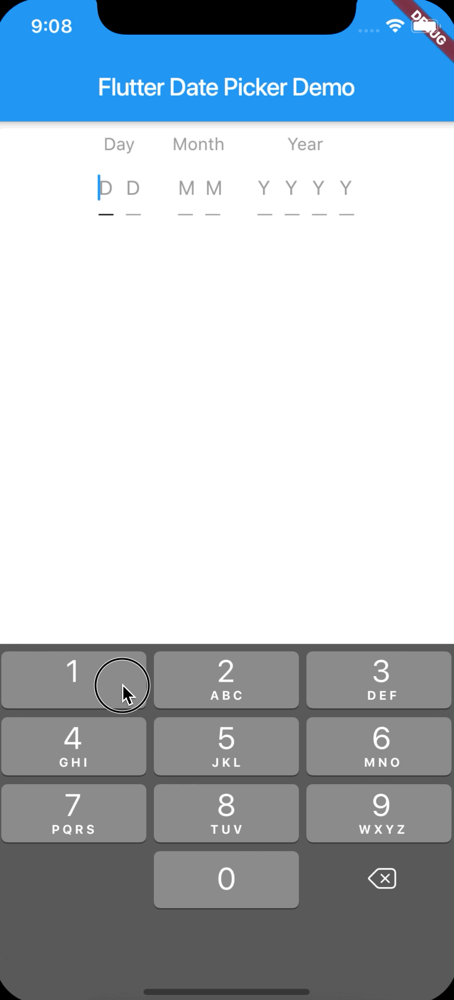

# Flutter: Date Picker Number

Easy in use date picker supported by numerical keyboard.


 


## Getting started

In the `pubspec.yaml` of your flutter project, add the following dependency:

```yaml
dependencies:
  ...
  flutter_date_picker_number: "^1.0.0"
```

In your library add the following import:

```dart
import 'package:flutter_date_picker_number/flutter_date_picker_number.dart';
import 'package:flutter_date_picker_number/flutter_date_picker_number_Settings.dart';
```

For help getting started with Flutter, view the online [documentation](https://flutter.io/).

# Usage

```dart
import 'package:flutter/material.dart';
import 'package:flutter_date_picker_number/flutter_date_picker_number.dart';
import 'package:flutter_date_picker_number/flutter_date_picker_number_Settings.dart';

void main() => runApp(MyApp());

class MyApp extends StatelessWidget {
  @override
  Widget build(BuildContext context) {
    return MaterialApp(
      home: MyHomePage(),
    );
  }
}

class MyHomePage extends StatefulWidget {
  @override
  _MyHomePageState createState() => _MyHomePageState();
}

class _MyHomePageState extends State<MyHomePage> {
  @override
  Widget build(BuildContext context) {
    return Scaffold(
      appBar: AppBar(
        title: Text(widget.title),
      ),
      body: Center(
        child: FlutterDatePickerNumber(
          FlutterDatePickerNumberSettings(
            initialDay: 25,
            initialMonth: 11,
            initialYear: 2019,
            dayHeaderText: 'Day',
            monthHeaderText: 'Month',
            yearHeaderText: 'Year',
            errorBorder: const UnderlineInputBorder(borderSide: BorderSide(color: Colors.red)),
            enabledBorder: const UnderlineInputBorder(borderSide: BorderSide(color: Colors.grey)),
            disabledBorder: const UnderlineInputBorder(borderSide: BorderSide(color: Colors.black)),
            focusedBorder: const UnderlineInputBorder(borderSide: BorderSide(color: Colors.black)),
            focusedErrorBorder: const UnderlineInputBorder(borderSide: BorderSide(color: Colors.red)),
            errorTextStyle: const TextStyle(color: Colors.red),
            headerTextStyle: const TextStyle(color: Colors.grey),
            inputStyle: const TextStyle(color: Colors.black),
            inputFieldPadding: const EdgeInsets.all(5),
            inputFieldWidth: 30,
          ),
          (day) {
            return day > 0 && day < 32 ? null : 'The Day does not match a Date Format.';
          },
          (month) {
            return month > 0 && month < 13 ? null : 'The Month does not match a Date Format.';
          },
          (year) {
            return year > 1900 && year < 2019 ? null : 'The year does not match a Date Format.';
          },
          (day, month, year) {
            DateTime dateTime = DateTime.utc(year, month, day);
            print('generated date time $dateTime');
          }
        ),
      ),
    );
  }
}
```

## Changelog

Please see the [Changelog](https://github.com/rajeshzmoke/flutter_date_picker/blob/master/CHANGELOG.md) page to know what's recently changed.

## License

```
Copyright 2019 Marcin Butanowicz

Permission is hereby granted, free of charge, to any person obtaining a copy of this software and associated documentation files (the "Software"), to deal in the Software without restriction, including without limitation the rights to use, copy, modify, merge, publish, distribute, sublicense, and/or sell copies of the Software, and to permit persons to whom the Software is furnished to do so, subject to the following conditions:

The above copyright notice and this permission notice shall be included in all copies or substantial portions of the Software.

THE SOFTWARE IS PROVIDED "AS IS", WITHOUT WARRANTY OF ANY KIND, EXPRESS OR IMPLIED, INCLUDING BUT NOT LIMITED TO THE WARRANTIES OF MERCHANTABILITY, FITNESS FOR A PARTICULAR PURPOSE AND NONINFRINGEMENT. IN NO EVENT SHALL THE AUTHORS OR COPYRIGHT HOLDERS BE LIABLE FOR ANY CLAIM, DAMAGES OR OTHER LIABILITY, WHETHER IN AN ACTION OF CONTRACT, TORT OR OTHERWISE, ARISING FROM, OUT OF OR IN CONNECTION WITH THE SOFTWARE OR THE USE OR OTHER DEALINGS IN THE SOFTWARE.

```